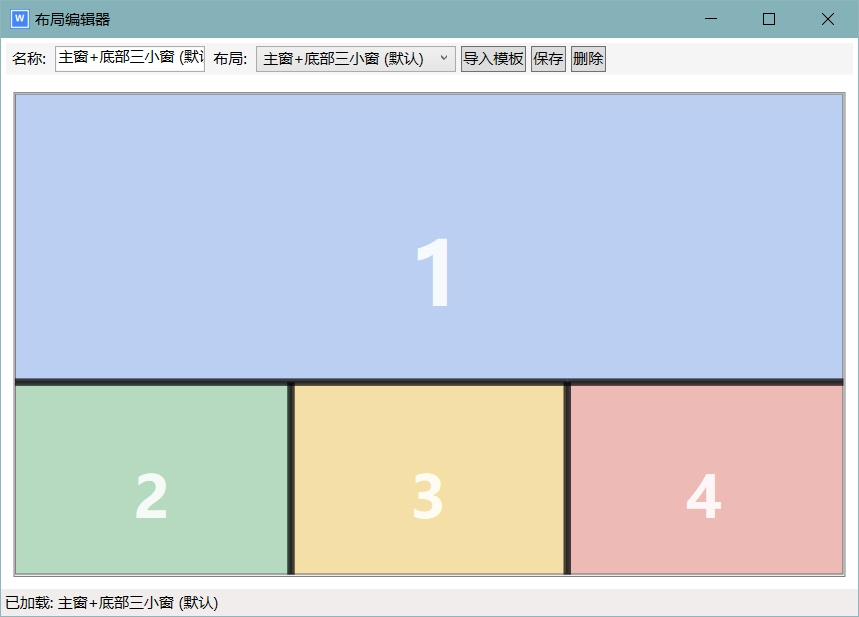
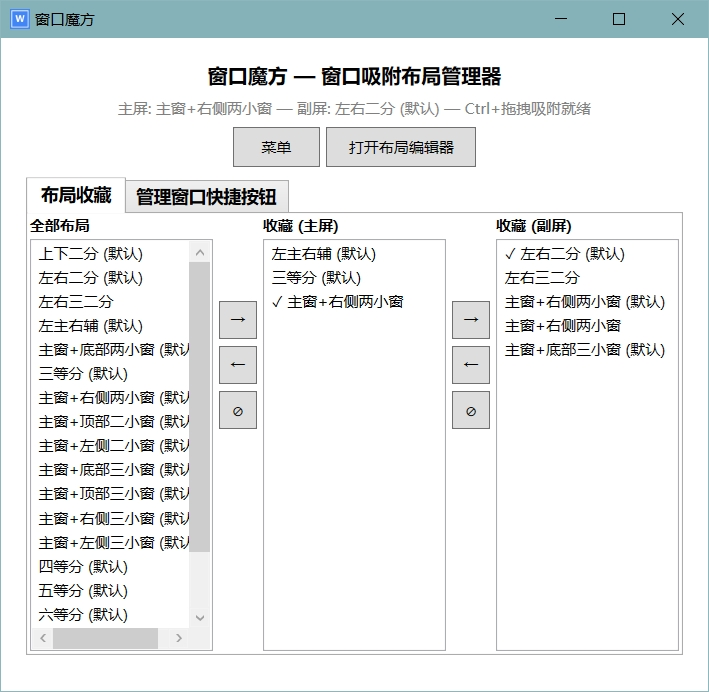
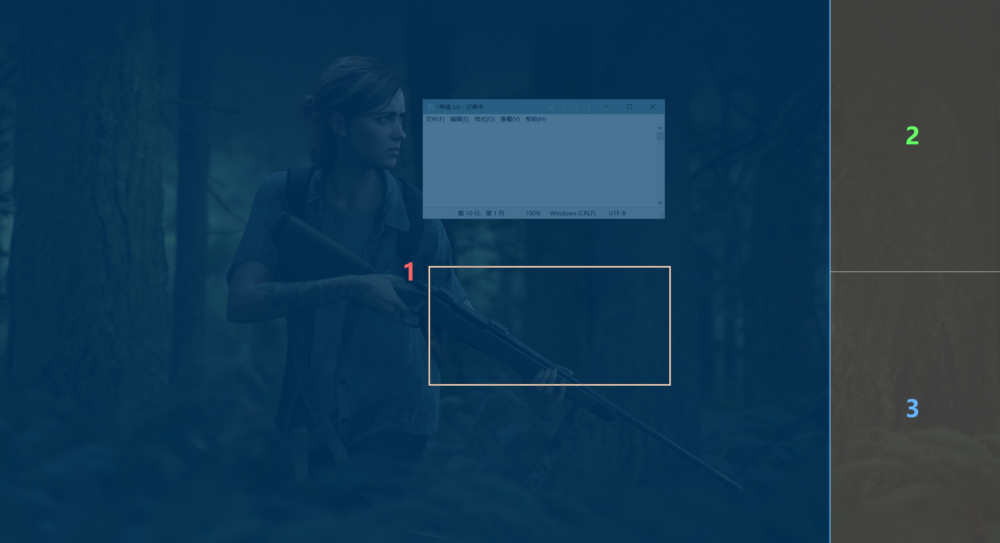

# 🧊 窗口魔方 (WindowCube)

Windows 窗口吸附布局管理工具。支持自定义布局分区、多显示器、虚拟桌面，通过拖拽快速将窗口排列到指定区域，提升桌面空间利用效率。

## ✨ 功能

- 🎨 **自定义布局** — 自由划分窗口吸附区域，支持预设模板
- 🖥️ **多显示器** — 每台显示器可设置独立的布局和收藏
- 🪟 **虚拟桌面** — 各桌面独立布局，切换时自动重排窗口
- 🖱️ **拖拽吸附** — 按住修饰键拖拽窗口，自动吸附到布局分区；支持堆叠模式
- 🔘 **窗口快捷按钮** — 在活动窗口标题栏显示吸附按钮，一键布局
- 🔍 **进程过滤** — 白名单/黑名单模式，精确控制哪些应用受管理
- 📦 **布局导入/导出** — 分享和备份你的布局配置
- ⌨️ **快捷键** — Win+1~9 快速切换收藏布局

## 📸 截图



自定义分割区域



收藏布局，支持两个屏幕


在窗口上有快捷按钮将该窗口一键飞到指定区域



拖拽中会显示分割区域

## 💻 系统要求

- Windows 10 或更高版本
- [.NET 8.0](https://dotnet.microsoft.com/download/dotnet/8.0)

## 📥 安装

### 下载预编译版本

从 [Releases](https://github.com/iambest1/WindowCube/releases) 页面下载最新版本，解压后运行 `WinLayout.exe`。

### 自行编译

```bash
git clone https://github.com/iambest1/WindowCube.git
cd WindowCube
dotnet publish -c Release -o publish
```

编译产物在 `publish/` 目录下，运行 `WinLayout.exe` 即可。

## 🚀 使用

1. 启动程序后，系统托盘中出现窗口魔方图标
2. 打开 **布局编辑器** 创建或编辑吸附分区
3. 将窗口收藏到布局后，通过托盘中菜单或快捷键 Win+1~9 切换
4. 按住 `Ctrl`（可自定义）拖拽窗口到分区位置即可吸附

## 🛠️ 构建技术

- WPF (.NET 8.0)
- Windows 原生 API（窗口管理、全局快捷键、鼠标钩子）
- 无第三方 UI 框架依赖

## 💖 赞助

如果窗口魔方对你有帮助，欢迎扫码赞助 ❤

| 微信 | 支付宝 |
|------|--------|
|  |  |

## 📄 许可证

[MIT](LICENSE)
